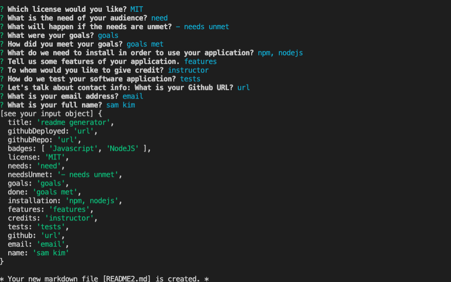

# Homework7-readmeMaker

**Demonstration Video**
https://drive.google.com/file/d/1BY9c9PR3NuLoif1sfpNufLUHuShWWIvr/view

**GitHub Repository URL**
https://github.com/TalkingSkunk/readmeMaker


## Table of Contents

* [Badges](#badges)
* [License](#license)
* [Description](#description)
* [Installation](#installation)
* [Features](#features)
* [Credits](#credits)
* [Contributing](#contributing)
* [Tests](#tests)
* [Contact](#contact)


## Badges

  
  
  
  


## License

MIT License

Copyright (c) 2021 sam k

Permission is hereby granted, free of charge, to any person obtaining a copy
of this software and associated documentation files (the "Software"), to deal
in the Software without restriction, including without limitation the rights
to use, copy, modify, merge, publish, distribute, sublicense, and/or sell
copies of the Software, and to permit persons to whom the Software is
furnished to do so, subject to the following conditions:

The above copyright notice and this permission notice shall be included in all
copies or substantial portions of the Software.

THE SOFTWARE IS PROVIDED "AS IS", WITHOUT WARRANTY OF ANY KIND, EXPRESS OR
IMPLIED, INCLUDING BUT NOT LIMITED TO THE WARRANTIES OF MERCHANTABILITY,
FITNESS FOR A PARTICULAR PURPOSE AND NONINFRINGEMENT. IN NO EVENT SHALL THE
AUTHORS OR COPYRIGHT HOLDERS BE LIABLE FOR ANY CLAIM, DAMAGES OR OTHER
LIABILITY, WHETHER IN AN ACTION OF CONTRACT, TORT OR OTHERWISE, ARISING FROM,
OUT OF OR IN CONNECTION WITH THE SOFTWARE OR THE USE OR OTHER DEALINGS IN THE
SOFTWARE.


## Description

### What needs are we meeting?
* You are a busy coder, and you need a fast generator of README.md, so that you can spend more time in coding.


### What would be the foreseeable consequences if the needs are unmet?
* You will not be able to save time, which could be spent on coding, or reading a good book.


### What were your goals?
* Create a logical Table of Contents.
* Ask for user inputs.
* Create the chosen license.
* Create the chosen badge(s).
* Create a standing template for markdown file.
* Notify user of completion.


### What have you done about it?
* All goals are met.


## Installation

* You need to install nodejs to your local computer.
* You need to create package.json and node_modules by entering:
    1. ``` npm init -y ```
    2. ``` npm install inquirer ```
* Run ``` node index.js ``` on your command line, and follow the prompts.


## Features

* Given you have started ``` node index.js ``` on your command line,
    * When you do not enter any inputs,
        - Then prompt will give an error message, and refuse to continue.
    * When you finish the prompts,
        - Then the application will create a new README.md file with your inputs.




## Credits

@Fil  

### Tutorials
* https://developer.mozilla.org/
* https://stackoverflow.com/


## Contributing

[Contributor Covenant](https://www.contributor-covenant.org/version/2/0/code_of_conduct/code_of_conduct.md)


## Tests

Non-testable.


## Contact

**GitHub: https://github.com/TalkingSkunk**  
**Email: sendtosamkim@gmail.com**


&copy; 2021 Sam Kim
